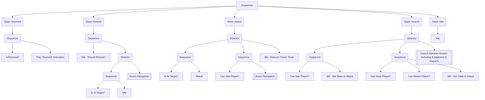
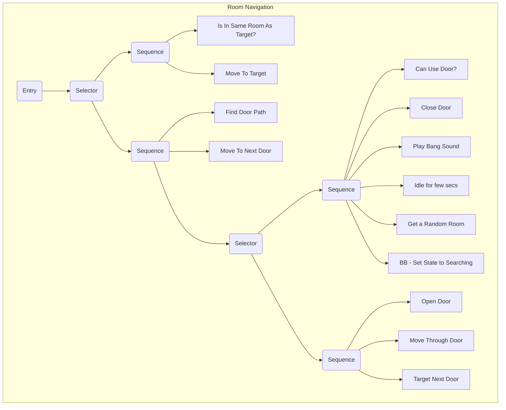

# Behaviour Tree AI Study: Mr X - Resident Evil 2 Remake
A technical exploration and recreation of the '_Mr. X_' AI system from _Resident Evil 2 Remake (2019)_ using my own implementation of a _Behaviour Tree (BT)_ system. This project serves as my first dive into video game AI by creating a BT from the ground up.

_Mr. X_ is a video game AI that hunts the player through the level, stalking the halls and searching rooms. I've attempted to reproduce that behaviour to learn how to create a basic BT system.

## Features
- A project exploring video game AI, recreating _RE2’s Mr. X_ with a Behaviour Tree **built from scratch** within Unity.
- **Composite** and **Action nodes** resembling patrol, search, chase, attack and other behaviours.
- **Room System** with AI Door handling for Room-to-Room navigation.
- **Object-Oriented architecture** using inheritance to define type-based and **abstract logic**.
- Room **real-time lighting optimisation** techniques.
- **Fully playable vertical slice** with **traditional gameplay systems** to test AI implementation in an in-game setting.

## The AI of Mr X
_Resident Evil 2 Remake (2019)_ reintroduces the innovative series staple hunter AI character prowling room to room, searching for the player, chasing them down until they escape or... he squashes their face.

The official AI model of _Mr. X_ has yet to be publically disclosed (as far as I'm aware). It could be a Finite State Machine (FSM) as much as it could be a _Behaviour Tree_. Having already experimented with FSMs before, I wanted to see if I could recreate this behaviour by creating my very first BT from the ground up.

### Behaviour Tree System
_Behaviour Trees (BT)_ are an AI model that gets its name from its tree-like structure and has been very popular within game development. It consists of various types of Nodes linked together forming behaviours of mixed complexity.
Chris Simpson (one of two programmers on Project Zomboid) wrote a great [article](https://www.gamedeveloper.com/programming/behavior-trees-for-ai-how-they-work) that goes into depth about the technicalities of BTs. It was instrumental in my understanding of this study. If you wish to learn more about the AI model itself, I highly recommend giving it a read!

> [!NOTE]
> There is no definitive way to create a BT. There are standardised methods or those more commonly used. Everyone's project is different and has unique requirements. The one found here has been created from scratch for study and may not be perfect as a reference. If that doesn't bother you then, as you were my friend!

#### Structure
My BT consists of numerous Action Nodes (MoveTo, OpenDoor, Idle, etc.), Conditional Nodes (IsAt, CanSeeObject, IsInSameRoomAs, etc.), standard Composite Nodes (Selector, Sequence, etc.) and some Service Nodes (FindDoorPathTo, GetRandomRoom, SetBlackBoardVariable, etc.).

These Nodes link together forming one of five different subtrees. Which subtree is run is determined by either Conditional Node either querying a _Blackboard_ variable ([see here for more](####Blackboard)) or the world state. For example, by querying whether the AI has been marked as stunned, we can branch off into playing the 'Stunned' animation and continue evaluating the rest of the tree on completion. _Keep in mind that some Nodes can be considered uninterruptable, meaning the tree cannot progress on subsequent ticks until the uninterruptable branch/node has been completed._

In general, the logic goes as follows:

_**Note:** The above is a simplified version of the tree. Please see the [code](Assets/Scripts/AI/Controller/AIBehaviourTreeController.cs) for a more 'code accurate' view._

#### Branching
When the BT branches, there may be some Nodes with dependencies that need to be reset in order to be used again the next time the Node(s) is active. 

Each tick, I log the Nodes being executed. Should the system determine some Nodes are no longer being executed, it will 'reset' those no longer active and log these new Nodes in their place. This helps when certain Nodes or sets of Branches are interrupted by branching further up the tree, causing these Nodes' context to be invalidated.

#### Blackboard
_Blackboards_ are essentially a list of useful variables one or many BTs can use. Whether they're relied on to change a BT's executing branch or contain references to the world state which some Nodes depend on. Without it, BTs wouldn't have an understanding of anything external to itself - _Blackboards_ are what immerses the AI into the world around them.

My BT contains variables to track the Target (whether it be the Player or the next Door in the path), the alert state of Mr. X, the current and reset timer value, and so on.  When Mr. X needed to go to the player, that action Node would utilise its BT context to access the reference from its associated Blackboard.

#### "Huh, what was that noise?"
To bring more life to Mr. X and to give the player some feedback, the AI needs to be aware of its surroundings. Allowing it to _see_ and _hear_ things not only gives him presence but also adds some more depth to the mechanics for the player to consider. It also feels very creepy...

Sight and Auditory abilities are quite similar logic-wise here. A Conditional Node queries an external component whether or not it can currently see something or has recently heard something of interest. This is usually done with physics overlapping and raycasting to check for validity until it returns back a result. If true, the Conditional Node will also return true and the BT will 'branch' into new logic nodes. 

Little fun extra to note, independent of this I also made Mr. X physically look at you whenever you're in sight which at first came off as a bit unnerving. So naturally I only developed during the day.

#### BT Events
Eventually, I needed to add BT logic that closely worked with external components while remaining decoupled. When Mr. X moved between rooms he moved through doors... but his head phased through the top like Danny Phantom. There are different methods to tackle this such as playing an animation with root motion, but I decided to utilise Unity's Animation Rigging package combined with events (does this technically make my BT event-driven? 😇).

##### Animation Rig Events
By asking an external component to handle this for us based on a different signal, we're able to create a simple Action Node that can ask the [AIAnimator](/Assets/Scripts/AI/Controller/AIAnimator.cs) to relay that signal and handle the rest for us. Another component, [AniRigEventSignalReceiver](/Assets/Scripts/Animation/Events/AniRigEventSignalReceiver.cs), is responsible for dishing out any logic subscribed to any of the UnityEvents.  

Whichever component is responsible for handling any events tied to that signal will do its thing - this also means, since the Animation Rig is set to bend Mr. X given a certain signal, he does exactly that. When we're ready, we send another to ask him to return to his normal stance (hopefully we didn't leave him hanging for too long!).

#### Visual Editor? About that...
A Visual Editor was at the top of the list of things to develop alongside this project, but unfortunately, it added additional intricacy that began to take from the main point of this study. As a result, the BT nodes are hardcoded (but formatted really nicely!). It's something I'd like to one day come back to and try implementing fully.

## Room System
When it comes to room navigation, video game AI devolve into Potatoes. Neither can do it, so we have to show them how. T-the AI, n-not the Potatoes...

### The Door Problem
[The Door Problem](https://lizengland.com/blog/2014/04/the-door-problem/) is an age-old game development pitfall where Doors quickly become the bain of existence. Though simple, they quickly introduce seemingly never-ending, recursive complexities that need accounting for.

Not only does Mr X need to use doors to navigate between rooms, but he needs to know which door to use, how to reach the door, how to open the door, _go through_ the door... but not before knowing which door is the correct door to use in the first place. Easy for us, but hard for video game characters.

In light of this, I developed a Room System solution for this project to navigate this issue and implemented it as a branch within the Behaviour Tree as Action nodes. It's primitive but does the trick.

### Bustin' Down the Door
The Room system is composed of multiple sub-systems that work together to achieve the desired result.

First, in Unity, I defined a Room by all the Floor objects that make up its foundation. As a Room also has at least one door, you can add these to a collection within the Room class. Doors are what connect Rooms, with this in mind, each door links to two rooms (or one if it leads outside). Now we have a network of Rooms, we can start shoving Mr X between them. (I eventually made a tool that automatically links Rooms and Doors together which made adding or removing rooms later on much quicker).

To traverse between Rooms, a Door has two entry points, one on either side. The AI can identify which entry point to use by requesting the Door to tell it which side it's on, returning that point. Continuing through the Behaviour Tree branch the AI navigates to that point, faces the Door, requests it to open, gracefully (not) bends over so as not to knock off his glorious hat, moves to the opposite entry point, and finds itself on the other side in another room ready to do the entire process again. And he doesn't even say thank you!

### Finding the Door

It's all well and good groovin' through doorways but it doesn't matter if you end up crashing someone's birthday party because you've gone through the wrong door. How does he know which network of rooms to navigate?

_Breadth-first search (BFS)_. After getting the Player's current Room, using the network of Rooms, I start from the AI's Room and traverse each Room via each of their Doors (adding them to a queue) before giving each Room a numeric value equal to that of the _BFS_ iteration. Once the Player's Room has been reached, I create a collection of Rooms by walking back to the starting Room through each neighbouring Room with a lower number than the last. This gives us our string of Rooms to navigate.

It's a simple solution. There will always be a more elegant or performant solution, but for this project, it worked.

## Improvements
Like all projects, there are always improvements to be made. I achieved what I set out to do and opened my mind to various considerations of AI development for video games (some less fun than others).

Modern Behaviour Trees are event-driven. _Unreal Engine's_ BT system is event-based and capitalises on gains, such as efficiency. _Unreal Engine_ was a great influence in the creation of my BT. As the types of BT differ, I may have added features from multiple BT types, potentially complicating my implementation. However, the BT I managed to create works well.

Starting over, there are things I'd do differently as I understand the workings of the AI model more now compared to when I started. So is the beauty of retrospectives.

## TL;DR
_Doors are very annoying._

## Screenshots

